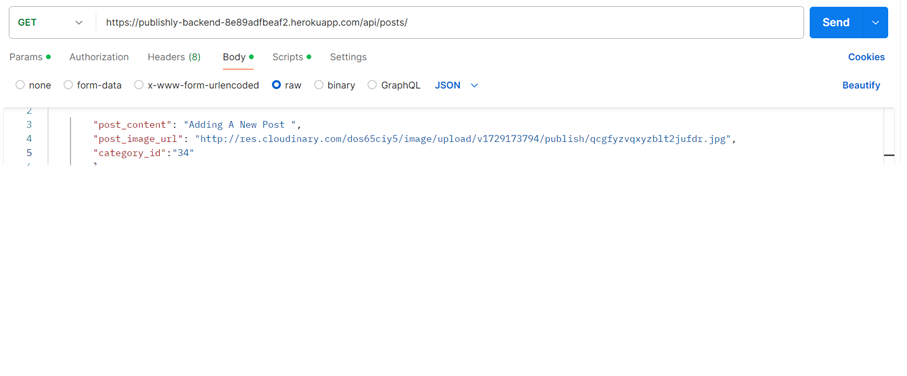
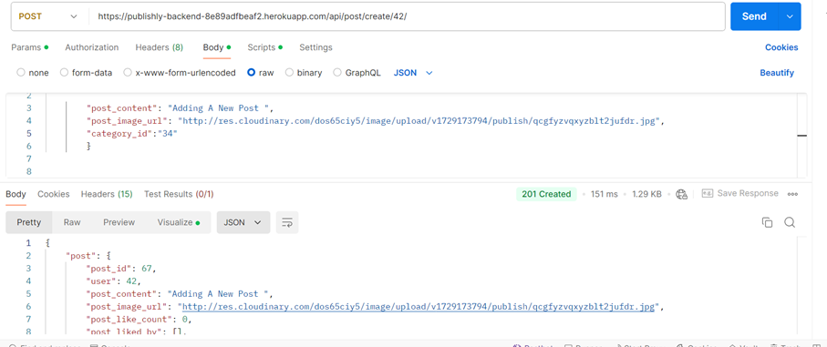
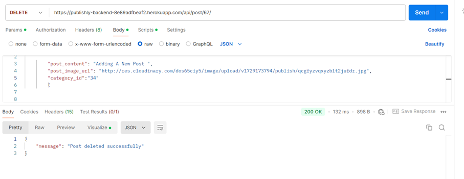
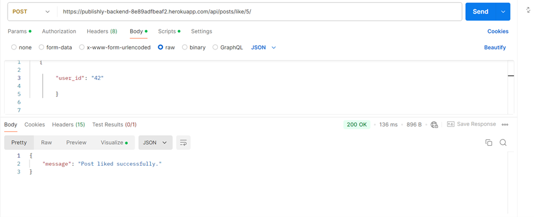
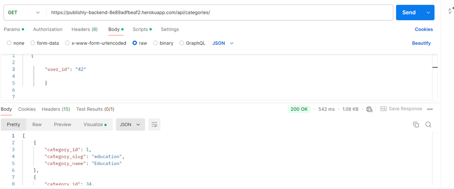
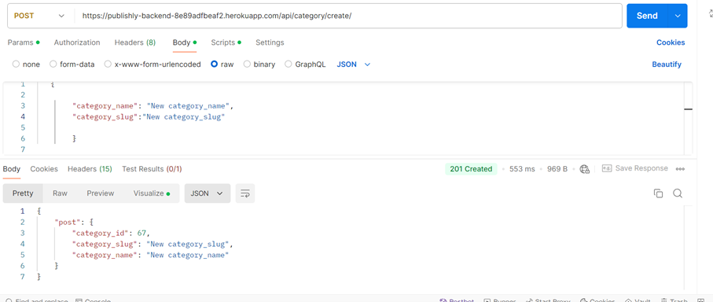
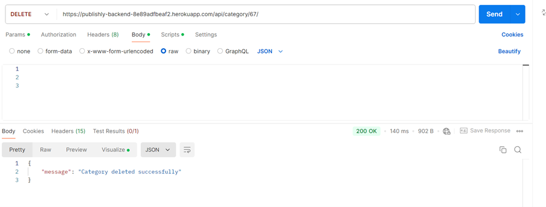

# Backend API Documentation

## Introduction

This project is a backend REST API developed using Django and Django Rest Framework. It handles user authentication, post creation, profile management, categories, followers, and post interactions like likes, dislikes, and comments.

## Requirements.txt

To get started with the project, you need to install the necessary dependencies. Here are the required packages listed in requirements.txt:

- asgiref==3.8.1
- dj-database-url==2.2.0
- Django==5.0.7
- django-cors-headers==4.4.0
- django-heroku==0.3.1
- djangorestframework==3.15.2
- djangorestframework-simplejwt==5.2.2

- gunicorn==22.0.0
- mysqlclient==2.2.4
- packaging==24.1
- psycopg2==2.9.9
- py==1.11.0
- sqlparse==0.5.1
- typing_extensions==4.12.2
- tzdata==2024.1
- whitenoise==6.7.0
- python-decouple==3.8
- django-environ==0.9.0

Install all dependencies using: 
- pip install -r requirements.txt

## Project Setup

### Environment Variables

You need to configure environment variables for sensitive data such as database credentials and the secret key. Use the following environment variables in a .env file:

- SECRET_KEY: Your Django secret key
- DEBUG: Set to True for development and False for production
- DATABASE_URL: URL for the database (e.g., PostgreSQL or MySQL)
- ALLOWED_HOSTS: List of allowed hosts for the application
For managing environment variables, the project uses python-decouple and django-environ.

## Running the Project

After configuring your environment, you can run the project locally with:
- python manage.py migrate  # Run migrations
- python manage.py runserver  # Start the development server

## Users Endpoints

- List Users: GET /api/users/
- Create User: POST /api/users/create/
- Retrieve User: GET /api/user/<int:pk>/
- Update User: PUT /api/user/update/<int:pk>/
- Delete User: DELETE /api/user/<int:pk>/
- User Login: POST /api/user/login/

## Profile Endpoints

- List Profiles: GET /api/profiles/
- Create Profile: POST /api/profile/create/<int:pk>/
- Retrieve Profile: GET /api/profile/<int:pk>/
- Update Profile: PUT /api/profile/update/<int:pk>/
- Delete Profile: DELETE /api/profile/<int:pk>/

## Followers Endpoints

- List Followers: GET /api/followers/
- Create Follower: POST /api/user/follow/<int:pk>/
- Delete Follower: DELETE /api/user/unfollow/<int:pk>/

## Posts Endpoints

- List Posts: GET /api/posts/
- Create Post: POST /api/post/create/<int:user_id>/
- Retrieve Post: GET /api/post/<int:pk>/
- Update Post: PUT /api/post/update/<int:pk>/
- Delete Post: DELETE /api/post/<int:pk>/
- Like Post: POST /api/posts/like/<int:post_id>/
- Dislike Post:Post /api/posts/dislike/<int:post_id>/

## Comment Endpoints

- List Comment: GET /api/comments/
- Create Comment: POST /api/comment/create/<int:post_id>/
- Retrieve Comment: GET /api/comment/<int:pk>/
- Update Comment: PUT /api/comment/update/<int:pk>/
- Delete Comment: DELETE /api/comment/<int:pk>/'

## Category Endpoints

- List Category: GET /api/categories/
- Create Category: POST /api/category/create/
- Retrieve Category: GET /api/category/<int:pk>/
- Update Category: PUT /api/category/update/<int:pk>/
- Delete Category: DELETE /api/category/<int:pk>/

## Manual Testing using Postman

### List all the posts

### Create a Post

### Delete a Post

### Like a Post

### List Categories

### Add a Category

### Delete a Category

